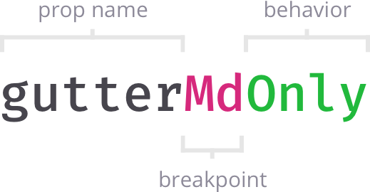

# Responsive props

## Introduction

Any prop is considered a responsive props if its name is suffixed with the enlisted breakpoint name and its behavior, if necessary.

## Declaration

To declare a responsive prop follow the next schema:

### **Behavior**

* `up` \(_Default_\) — Applies the given value from the specified breakpoint and up,
* `down` — Applies the given value from the specified breakpoint and down,
* `only` — Applies the given value only for the specified breakpoint.


Atomic layout is mobile-first. That means that all responsive properties are applied starting from the given breakpoint and **up**, unless more specific values are met.


## Default statements

* Default breakpoint behavior is `up`,
* Default measurement unit for numeric prop values is `rem`,
* When not suffixed, any prop value is applied for `xs` screen size and `up`.

## Props

Each of the props below can be used as a responsive prop when properly suffixed.

### Grid

| **Prop name** | **CSS properties** |
| --- | --- | --- | --- | --- | --- | --- | --- | --- | --- | --- | --- | --- |
| `template` | [`grid-template-areas`](https://developer.mozilla.org/en-US/docs/Web/CSS/grid-template-areas) |
| `templateCols` | [`grid-template-columns`](https://developer.mozilla.org/en-US/docs/Web/CSS/grid-template-columns) |
| `templateRows` | [`grid-template-rows`](https://developer.mozilla.org/en-US/docs/Web/CSS/grid-template-rows) |
| `gutter` | [`grid-gutter`](https://developer.mozilla.org/en-US/docs/Web/CSS/grid-gutter) |
| `gutterCol` | [`gutter-column`](https://developer.mozilla.org/en-US/docs/Web/CSS/gutter-column) |
| `gutterRow` | [`gutter-row`](https://developer.mozilla.org/en-US/docs/Web/CSS/gutter-row) |
| `col` | [`grid-column`](https://developer.mozilla.org/en-US/docs/Web/CSS/grid-column) |
| `colStart` | [`grid-column-start`](https://developer.mozilla.org/en-US/docs/Web/CSS/grid-column-start) |
| `colEnd` | [`grid-column-end`](https://developer.mozilla.org/en-US/docs/Web/CSS/grid-column-end) |
| `row` | [`grid-row`](https://developer.mozilla.org/en-US/docs/Web/CSS/grid-row) |
| `rowStart` | [`grid-row-start`](https://developer.mozilla.org/en-US/docs/Web/CSS/grid-row-start) |
| `rowEnd` | [`grid-row-end`](https://developer.mozilla.org/en-US/docs/Web/CSS/grid-row-end) |

### Positioning

| **Prop name** | **CSS properties** |
| --- | --- | --- | --- | --- | --- | --- | --- | --- | --- |
| `align` | [`align-self`](https://developer.mozilla.org/en-US/docs/Web/CSS/align-self) |
| `alignItems` | [`align-items`](https://developer.mozilla.org/en-US/docs/Web/CSS/align-items) |
| `alignContent` | [`align-content`](https://developer.mozilla.org/en-US/docs/Web/CSS/align-content) |
| `justify` | [`justify-self`](https://developer.mozilla.org/en-US/docs/Web/CSS/justify-self) |
| `justifyItems` | [`justify-items`](https://developer.mozilla.org/en-US/docs/Web/CSS/justify-items) |
| `justifyContent` | [`justify-content`](https://developer.mozilla.org/en-US/docs/Web/CSS/justify-content) |
| `place` | `place` |
| `placeItems` | [`place-items`](https://developer.mozilla.org/en-US/docs/Web/CSS/place-items) |
| `placeContent` | [`place-content`](https://developer.mozilla.org/en-US/docs/Web/CSS/place-content) |

### Dimensions

| **Prop name** | **CSS properties** |
| --- | --- | --- |
| `height` | `height` |
| `width` | `width` |

### Space

| **Prop name** | **CSS properties** |
| --- | --- | --- | --- | --- | --- | --- | --- | --- | --- | --- | --- | --- | --- | --- |
| `margin` | `margin` |
| `marginVertical` | `margin-top` and `margin-bottom` |
| `marginHorizontal` | `margin-right` and `margin-left` |
| `marginTop` | `margin-top` |
| `marginRight` | `margin-right` |
| `marginBottom` | `margin-bottom` |
| `marginLeft` | `margin-left` |
| `padding` | `padding` |
| `paddingVertical` | `padding-top` and `padding-bottom` |
| `paddingHorizontal` | `padding-right` and `padding-left` |
| `paddingTop` | `padding-top` |
| `paddingRight` | `padding-right` |
| `paddingBottom` | `padding-bottom` |
| `paddingLeft` | `padding-left` |

## Examples

* `gutter` — Sets gutter for all screen sizes \(from `xs` and all the way up\), 
* `marginVerticalMd` — Applies margin-top and margin-bottom for `md` screen sizes and up,
* `placeItemsLgOnly` — Places the child items for `lg` screens only,

